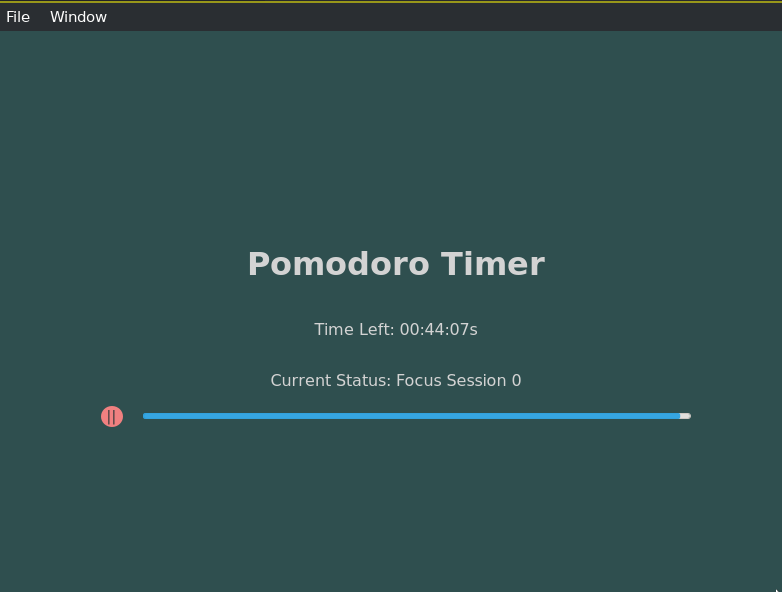

# Time Tracker

Time tracker app.

## Roadmap

- [x] Add Pomodoro timer with notification support.
- [ ] Store and retrieve record of Pomodoro sessions.
- [ ] Attach some kind of description and project to each session.
- [ ] Add helpful visualization for the same.

## Setup

```bash
cargo install trunk tauri-cli
```

## Development

```bash
cargo tauri dev
```

## Build

```bash
cargo tauri build
```

## Screenshot


